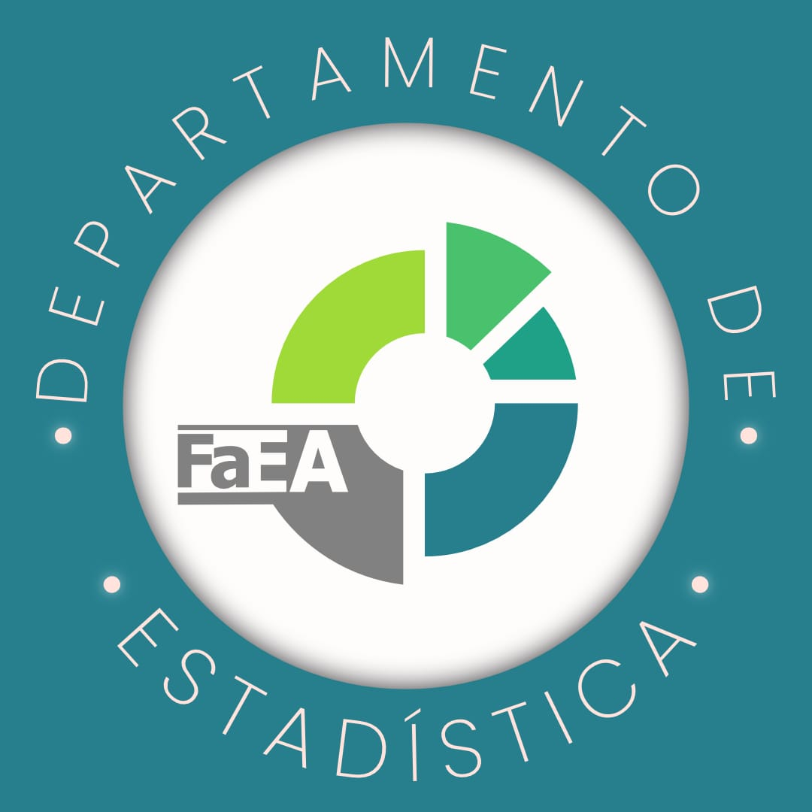

## Estadística aplicada a Higiene y Seguridad

**Edición 2026 · Versión 1.0**

## Estadística aplicada a Higiene y Seguridad

Recurso educativo digital interactivo diseñado para favorecer el aprendizaje de la Estadística aplicada a Higiene y Seguridad mediante explicaciones, ejemplos contextualizados, actividades y autoevaluaciones.

Esta entrega desarrolla las Unidades 1 y 2 y está preparada para funcionar como sitio estático en GitHub Pages.

## Estructura

- `index.html`: contenido completo y navegación.
- `css/estilos.css`: identidad visual, diseño responsive e impresión.
- `js/app.js`: actividades, gráficos SVG, navegación y guardado local del progreso.
- `assets/img/`: imágenes institucionales y de la SRT.
- `assets/documentos/`: informes de la SRT utilizados como fuentes.

## Abrir localmente

1. Descomprimir toda la carpeta.
2. Abrir `index.html` con Chrome, Edge o Firefox.
3. No abrir el archivo directamente dentro del ZIP.

## Publicar en GitHub Pages

1. Crear un repositorio público.
2. Subir **el contenido interno** de esta carpeta, de modo que `index.html` quede en la raíz.
3. Ir a `Settings > Pages`.
4. Elegir `Deploy from a branch`, rama `main`, carpeta `/ (root)`.
5. Guardar y esperar a que GitHub muestre la dirección del sitio.

## Personalización

- El enlace al aula PEDCO se edita en `index.html`, buscando `id="enlace-pedco"`.
- Los colores principales están al comienzo de `css/estilos.css`, dentro de `:root`.
- Los ejemplos interactivos y respuestas se encuentran en `js/app.js`.
- Los textos teóricos están en `index.html`.

## Principios didácticos

- La explicación construye el concepto y la interacción lo potencia.
- El desarrollo general es independiente del TP vigente.
- PEDCO concentra materiales oficiales, actividades acreditables y entregas.
- Solo la estación final vincula explícitamente con el TP1 y Excel.
- Los contextos profesionales se utilizan para dar sentido a la Estadística sin convertir el sitio en un manual de Higiene y Seguridad.

## Tecnologías

HTML5, CSS3, JavaScript, SVG, MathJax y `localStorage`. No requiere servidor ni base de datos.

## Autora: Candelaria Morelli

Departamento de Estadística – Facultad de Economía y Administración

Universidad Nacional del Comahue

## Licencia

Este recurso educativo puede utilizarse con fines académicos citando la autoría.

© 2026 Candelaria Morelli – Universidad Nacional del Comahue.
